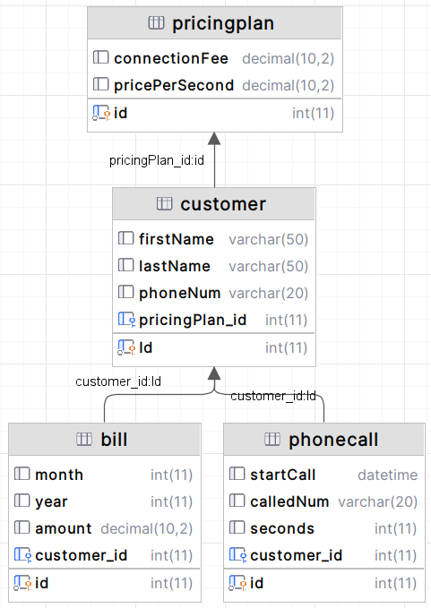

# Телефонная система

## Структура базы данных

### Таблицы

- CUSTOMER (Id, FirstName, LastName, PhoneNum, PlanId)
- PRICINGPLAN (Id, ConnectionFee, PricePerSecond)
- PHONECALL (Id, StartCall, CalledNum, Seconds, CustomerId)
- BILL (Id, Month, Year, Amount, CustomerId)

### Задание 1

Необходимо запретить удаление и обновление данных в таблице PHONECALL, разрешив только вставку новых записей.

### Задание 2

Требуется написать триггер, который автоматически обновляет счет (amount) за звонки в таблице BILL при добавлении записи в таблицу PHONECALL. В таблице BILL должна быть только одна запись для каждого клиента на каждый месяц.

### Задание 3

Необходимо реализовать консольное приложение на Java, которое предоставляет следующие возможности:

1. Ввод информации о клиентах.
2. Регистрация звонков.
3. Печать счета за текущий месяц для абонентов.